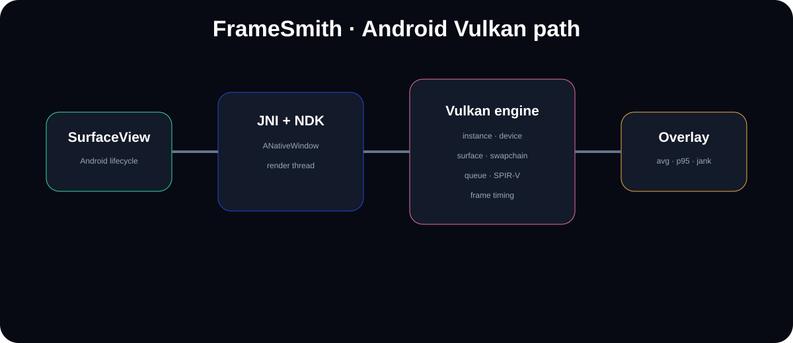

# FrameSmith

<p align="center"></p>

<p align="center"></p>

**Android NDK + Vulkan rendering and frame-pacing laboratory.**

FrameSmith is an Android graphics project built around a native Vulkan engine, explicit Android surface ownership, a render thread, swapchain lifecycle hooks, shader sources and a live frame-time overlay. The project intentionally exposes driver-facing Vulkan concepts instead of hiding them behind a game engine.

## Stack

`Kotlin → SurfaceView → JNI → ANativeWindow → Vulkan instance/device/surface/swapchain → frame pacing overlay`

## Build

Open in Android Studio, install SDK 35 + NDK + CMake, then run on a Vulkan-capable Android device. Vulkan is available through Android's native `libvulkan` on supported devices.

```bash
./gradlew :app:assembleDebug
adb install -r app/build/outputs/apk/debug/app-debug.apk
```

## What the code exercises

- Vulkan instance and physical-device discovery
- graphics queue-family selection
- Android `VkSurfaceKHR` creation
- logical device + swapchain extension setup
- swapchain lifecycle boundary
- GLSL shader assets ready for SPIR-V compilation
- native render thread
- frame-time rolling average + p95 jank detector
- Android lifecycle through `SurfaceHolder.Callback`
- GPU/device report helper using `adb`

## Driver-oriented design

Vulkan moves responsibility such as pipeline reuse and synchronization decisions from the driver into the application. FrameSmith keeps those responsibilities visible so future milestones can add explicit semaphores/fences, image acquisition/presentation, pipeline caches, timestamp queries and validation-layer telemetry without changing the architecture.

## Host CI

The frame-pacing core compiles as ordinary C++ and is tested on every push. A separate Android GitHub Actions job provisions SDK/NDK/CMake and builds the APK.

## Honest status

The project currently implements real Vulkan instance/device/surface ownership and the Android NDK/JNI path. The swapchain-render/present loop is the next renderer milestone; the source marks that boundary explicitly rather than pretending a rendered scene exists before it does.
